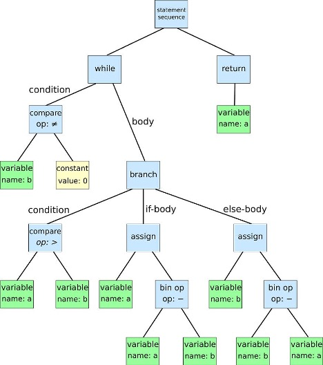
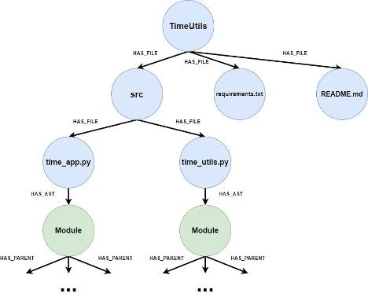

# Codebase Knowledge Graph RAG LLM Playbook

## Table of Contents
1. [Introduction](#introduction)
2. [System Architecture](#system-architecture)
3. [Core Components](#core-components)
4. [Data Pipeline](#data-pipeline)
5. [Knowledge Graph Construction](#knowledge-graph-construction)
6. [RAG Implementation](#rag-implementation)
7. [Deployment Guide](#deployment-guide)
8. [Usage Examples](#usage-examples)
9. [Best Practices](#best-practices)
10. [Troubleshooting](#troubleshooting)

---

## Introduction

This playbook provides a comprehensive guide for the **Codebase Knowledge Graph RAG LLM** system - an intelligent solution that automatically extracts, analyzes, and provides semantic search capabilities across complex Databricks codebases using knowledge graphs and Retrieval-Augmented Generation (RAG).

### Key Features
- **Automated Code Parsing**: Extracts tables, columns, and transformations metadata from Databricks notebooks
- **Knowledge Graph Construction**: Builds comprehensive entity-relationship graphs using Delta Lake
- **Vector Search Integration**: Enables semantic search across codebase elements
- **LLM-Powered Analysis**: Provides intelligent code analysis and impact assessment
- **Real-time Updates**: Continuously monitors and updates lineage as code evolves

### Problem Solved
Data stewards and engineers currently face manual, notebook-by-notebook analysis to understand:
- Column-level lineage and dependencies
- Downstream impacts of schema changes
- Complex transformation logic and data flows
- Regulatory compliance requirements

This system provides **90% reduction in manual analysis time** with complete visibility across all notebooks.

---

## System Architecture

```
┌─────────────────────────────────────────────────────────────────────┐
│                        User Interface                               │
│  ┌─────────────────┐  ┌──────────────────┐  ┌──────────────────┐    │
│  │   RAG Agent     │  │  Vector Search   │  │  Graph Queries   │    │
│  │  (LangChain)    │  │   (Databricks)   │  │   (Cypher/SPARQL)│    │
│  └─────────────────┘  └──────────────────┘  └──────────────────┘    │
├─────────────────────────────────────────────────────────────────────┤
│                    Knowledge Graph Layer                            │
│  ┌─────────────────┐  ┌──────────────────┐  ┌─────────────────┐     │
│  │   Nodes Table   │  │   Edges Table    │  │  Quality Metrics│     │
│  │  (DLT Pipeline) │  │  (DLT Pipeline)  │  │   (Monitoring)  │     │
│  └─────────────────┘  └──────────────────┘  └─────────────────┘     │
├─────────────────────────────────────────────────────────────────────┤
│                    Data Processing Pipeline                         │
│  ┌─────────────────┐  ┌──────────────────┐  ┌────────────────────┐  │
│  │ Notebook Reader │  │  Code Parser     │  │  Metadata Extractor│  │
│  │  (Excel/CSV)    │  │ (SQLGlot/AST)    │  │  (Schema/Props)    │  │
│  └─────────────────┘  └──────────────────┘  └────────────────────┘  │
├─────────────────────────────────────────────────────────────────────┤
│                    Source Layer                                     │
│  ┌─────────────────┐  ┌──────────────────┐  ┌─────────────────┐     │
│  │ Databricks API  │  │  Unity Catalog   │  │  Workspace Files│     │
│  │  (Notebooks)    │  │   (Metadata)     │  │   (Excel/CSV)   │     │
│  └─────────────────┘  └──────────────────┘  └─────────────────┘     │
└─────────────────────────────────────────────────────────────────────┘
```

---

## Graph Explanations and Examples

### Code and its graph as example
```python
while b ≠ 0:
    if a > b:
        a := a - b
    else:
        b := b - a
return a
```


### Repository tree structure to Graph
```
TimeUtils/
├── src/
│   ├── time_app.py
│   └── time_utils.py
├── requirements.txt
└── README.md
```
For splitting the source code, AST can be used to identify the exact location boundary for each source code component (class, functions …). Using the CodeSplitter, we can get the following chunks:
```
############################ Chunk 1 ############################
from datetime import datetime
import pytz

############################ Chunk 2 ############################
def get_current_utc_time():
    """Returns the current UTC time as a formatted string."""
    utc_now = datetime.now(pytz.utc)
    return utc_now.strftime("%Y-%m-%d %H:%M:%S")

############################ Chunk 3 ############################
def convert_time_to_timezone(timezone_str):
    """Converts the current UTC time to a specified timezone."""
    try:
        local_zone = pytz.timezone(timezone_str)
        local_time = datetime.now(local_zone)
        return local_time.strftime("%Y-%m-%d %H:%M:%S")
    except pytz.exceptions.UnknownTimeZoneError:
        return "Invalid timezone."
```


Now if we ask a RAG chatbot based on CodeSplitter about "What does the convert_time_to_timezone function do?", it should be able to answer it correctly.

This graphs can be stored in a graph database such as Neo4J, and our previous two questions: "How many functions are defined in the time_utils.py file?", or "List all files where the variable local_zone is used" can be answered with a LLM that is capable of generating the following answers:
```
Generated Cypher:
MATCH (f:file {filename: 'time_util.py'})-[:HAS_AST]->(root:ast)
MATCH (root)-[:PARENT_OF*]->(func:ast {type: 'function_definition'})
RETURN count(func) AS NumberOfFunctions
Full Context:
[{'NumberOfFunctions': 2}]

{'input': 'How many functions are defined in the time_utils.py file?',
 'output': 'There are 2 functions defined in the time_utils.py file.'}
 ```
 ```
 Generated Cypher:
MATCH (f:file)-[:HAS_AST]->(root:ast)
MATCH (root)-[:PARENT_OF*]->(func:ast{{type: 'identifier', text: 'local_zone'}})
RETURN f
Full Conext:
[{'f': { 'filename': 'time_utils.py' }}]

{'input': 'List all files where the variable local_zone is used.',
 'output': 'The variable local_zone is used in the time_utils.py file'}
 ```
## Core Components

### 1. **Notebook Reader (`notebook_reader.py`)**
**Purpose**: Extracts notebook paths from Excel/CSV files and validates them against the Databricks workspace.

**Key Features**:
- Supports Excel (.xlsx, .xls) and CSV file formats
- Automatic path column detection
- Workspace validation with caching
- Batch processing with retry logic

**Usage**:
```python
from notebook_reader import NotebookPathReader

reader = NotebookPathReader()
paths = reader.read_from_excel(
    'notebooks.xlsx', 
    sheet_name='Sheet1', 
    path_column='Path'
)

# Validate paths against workspace
validation_results = reader.validate_paths_against_workspace(paths)
```

### 2. **Notebook API Client (`notebook_api.py`)**
**Purpose**: Retrieves notebook content from Databricks workspace using the Databricks SDK.

**Key Features**:
- Token-based authentication via secret management
- Multiple content formats (SOURCE, HTML, JUPYTER)
- Retry logic with exponential backoff
- Comprehensive error handling

**Usage**:
```python
from notebook_reader import DatabricksSecretProvider
from notebook_api import DatabricksNotebookClient

# Initialize authentication
secret_provider = DatabricksSecretProvider(
    scope="DEFAULT",
    token_key="DATABRICKS_TOKEN",
    url_key="DATABRICKS_HOST"
)

# Create client and retrieve content
client = DatabricksNotebookClient(auth_provider=secret_provider)
content = client.get_notebook_content(path="/Workspace/Path/To/Notebook")
```

### 3. **Knowledge Graph Nodes (`knowledge_graph_nodes_dlt.py`)**
**Purpose**: DLT pipeline for creating and managing knowledge graph nodes table.

**Key Features**:
- Unity Catalog integration with comprehensive schema
- Data quality expectations and validation
- Partitioning by entity type for performance
- Quality metrics generation

**Schema**:
```python
NODES_SCHEMA = StructType([
    StructField("node_id", StringType(), False),
    StructField("entity_type", StringType(), False),  # table, column, transformation, function
    StructField("entity_name", StringType(), False),
    StructField("properties", MapType(StringType(), StringType()), True),
    StructField("embedding", ArrayType(FloatType()), True),
    StructField("is_active", BooleanType(), True),
    StructField("version", IntegerType(), True),
    StructField("created_at", TimestampType(), True),
    StructField("updated_at", TimestampType(), True)
])
```

### 4. **Knowledge Graph Edges (`knowledge_graph_edges_dlt.py`)**
**Purpose**: DLT pipeline for creating and managing knowledge graph edges table.

**Key Features**:
- Referential integrity with nodes table
- Relationship type partitioning
- Confidence scoring for probabilistic relationships
- Change Data Capture (CDC) support

**Schema**:
```python
EDGES_SCHEMA = StructType([
    StructField("edge_id", StringType(), False),
    StructField("source_node_id", StringType(), False),
    StructField("target_node_id", StringType(), False),
    StructField("relationship_type", StringType(), False),  # contains, defines, consumes, transforms_into
    StructField("properties", MapType(StringType(), StringType()), True),
    StructField("confidence_score", FloatType(), True),
    StructField("is_active", BooleanType(), True),
    StructField("version", IntegerType(), True),
    StructField("created_at", TimestampType(), True)
])
```

---

## Data Pipeline

### Pipeline Flow
1. **Source Extraction**: Read notebook paths from Excel/CSV files
2. **Content Retrieval**: Fetch notebook content via Databricks API
3. **Code Parsing**: Extract metadata using SQLGlot and Python AST
4. **Graph Construction**: Create nodes and edges in Delta Lake tables
5. **Vector Embedding**: Generate embeddings for semantic search
6. **Quality Validation**: Apply data quality checks and metrics

### Configuration
```yaml
pipeline_config:
  # Source configuration
  source_file: "notebooks.xlsx"
  source_sheet: "Sheet1"
  path_column: "Path"
  
  # Processing configuration
  batch_size: 20
  max_retries: 3
  backoff_base: 0.5
  
  # Graph configuration
  node_types: ["table", "column", "transformation", "function"]
  edge_types: ["contains", "defines", "consumes", "transforms_into"]
  
  # Quality configuration
  min_confidence_score: 0.7
  enable_cdc: true
  auto_optimize: true
```

---

## Knowledge Graph Construction

### Node Types
1. **Table**: Represents data tables in the system
   - Properties: schema, location, format, size
   - Embedding: table description and column metadata

2. **Column**: Represents individual columns within tables
   - Properties: data_type, nullable, default_value, constraints
   - Embedding: column name, description, and usage patterns

3. **Transformation**: Represents data transformation operations
   - Properties: operation_type, parameters, complexity
   - Embedding: transformation logic and business rules

4. **Function**: Represents user-defined functions
   - Properties: parameters, return_type, complexity
   - Embedding: function signature and documentation

### Edge Types
1. **contains**: Table → Column (table contains columns)
2. **defines**: Transformation → Column (transformation defines output column)
3. **consumes**: Transformation → Column (transformation consumes input column)
4. **transforms_into**: Column → Column (column transforms into another column)

### Graph Query Examples
```sql
-- Find all columns that depend on a specific column
SELECT DISTINCT target.entity_name as dependent_column
FROM edges e
JOIN nodes source ON e.source_node_id = source.node_id
JOIN nodes target ON e.target_node_id = target.node_id
WHERE source.entity_name = 'customer_id' 
  AND e.relationship_type = 'consumes';

-- Find transformation chain for a table
WITH RECURSIVE lineage AS (
  SELECT source_node_id, target_node_id, relationship_type, 1 as depth
  FROM edges 
  WHERE target_node_id IN (
    SELECT node_id FROM nodes WHERE entity_name = 'final_customer_table'
  )
  UNION ALL
  SELECT e.source_node_id, e.target_node_id, e.relationship_type, l.depth + 1
  FROM edges e
  JOIN lineage l ON e.target_node_id = l.source_node_id
  WHERE l.depth < 10
)
SELECT * FROM lineage ORDER BY depth;
```

---

## RAG Implementation

### Vector Search Setup
```python
# Configure Vector Search endpoint
vectorsearch_config = {
    "endpoint_name": "codebase_knowledge_graph",
    "index_name": "bcp_ide.knowledge_graph.codebase_embeddings",
    "embedding_dimension": 1024,
    "metric_type": "COSINE"
}

# Generate embeddings for nodes
def generate_node_embeddings(node_data):
    """Generate embeddings for knowledge graph nodes."""
    embedding_model = get_embedding_model()
    
    # Create embedding text from node properties
    embedding_text = f"""
    Entity Type: {node_data['entity_type']}
    Entity Name: {node_data['entity_name']}
    Properties: {node_data['properties']}
    """
    
    return embedding_model.encode(embedding_text)
```

### RAG Agent Configuration
```python
# Configure RAG agent for codebase analysis
rag_config = {
    "llm_model": "databricks-claude-3-7-sonnet",
    "temperature": 0.0,
    "max_tokens": 4000,
    "system_prompt": """
    You are an expert data lineage analyst. You help users understand:
    - Data dependencies and transformations
    - Impact analysis for schema changes
    - Code complexity and business logic
    - Compliance and governance requirements
    
    Use the knowledge graph to provide accurate, detailed responses.
    """,
    "retrieval_config": {
        "k": 8,
        "query_type": "hybrid",
        "reranking": True
    }
}
```

### Query Examples
```python
# Example RAG queries for codebase analysis
queries = [
    "What tables depend on the customer_id column?",
    "Show me the transformation chain for the final_customer_table",
    "Which functions are used in data quality checks?",
    "What is the impact of changing the customer_type column?",
    "Find all transformations that use window functions"
]
```

---

## Deployment Guide

### Prerequisites
1. Databricks workspace with Unity Catalog enabled
2. Databricks Runtime 14.3+ with DLT support
3. Vector Search endpoint configured
4. Model Serving endpoint for LLM access
5. Appropriate permissions for workspace access

### Step 1: Environment Setup
```bash
# Install required packages
%pip install -U mlflow databricks-langchain databricks-agents langgraph==0.3.4
%pip install sqlglot pandas openpyxl databricks-sdk
```

### Step 2: Configure Secrets
```python
# Set up Databricks secrets for API access
dbutils.secrets.put(
    scope="DEFAULT",
    key="DATABRICKS_TOKEN",
    value="your-databricks-token"
)

dbutils.secrets.put(
    scope="DEFAULT", 
    key="DATABRICKS_HOST",
    value="https://your-workspace.cloud.databricks.com"
)
```

### Step 3: Deploy DLT Pipelines
```python
# Deploy nodes table pipeline
%run ./src/silver/knowledge_graph_nodes_dlt

# Deploy edges table pipeline  
%run ./src/silver/knowledge_graph_edges_dlt

# Run post-creation setup
run_post_creation_setup()
run_tests()
```

### Step 4: Configure Vector Search
```python
# Create Vector Search index
from databricks.vectorsearch import VectorSearchClient

client = VectorSearchClient()
index = client.create_delta_sync_index(
    endpoint_name="codebase_knowledge_graph",
    index_name="bcp_ide.knowledge_graph.codebase_embeddings",
    source_table_name="bcp_ide.knowledge_graph.nodes_table",
    pipeline_type="TRIGGERED",
    primary_key="node_id",
    embedding_source_column_name="embedding"
)
```

### Step 5: Deploy RAG Agent
```python
# Log and register RAG agent
mlflow.models.set_model(RAG_AGENT)
uc_model_info = mlflow.register_model(
    model_uri=logged_agent_info.model_uri,
    name="codebase-lineage-rag-agent"
)

# Deploy to serving endpoint
deployment_info = agents.deploy(
    model_name="codebase-lineage-rag-agent",
    model_version=uc_model_info.version
)
```

---

## Usage Examples

### 1. Impact Analysis
```python
# Analyze impact of changing a column
def analyze_column_impact(column_name: str):
    """Analyze the impact of changing a specific column."""
    
    # Query knowledge graph for dependencies
    query = f"""
    What tables, transformations, and functions depend on the {column_name} column?
    Show me the complete dependency chain and potential impact of changes.
    """
    
    # Get RAG response
    response = rag_agent.invoke({
        "query": query,
        "context": "impact_analysis"
    })
    
    return response
```

### 2. Lineage Visualization
```python
# Generate lineage diagram
def generate_lineage_diagram(table_name: str, max_depth: int = 5):
    """Generate a lineage diagram for a specific table."""
    
    # Query for lineage information
    query = f"""
    Create a detailed lineage diagram for the {table_name} table.
    Include all upstream and downstream dependencies up to {max_depth} levels.
    Show transformation types and data flow direction.
    """
    
    # Get visualization response
    response = rag_agent.invoke({
        "query": query,
        "context": "lineage_visualization"
    })
    
    return response
```

### 3. Code Complexity Analysis
```python
# Analyze code complexity
def analyze_code_complexity(notebook_path: str):
    """Analyze the complexity of a specific notebook."""
    
    # Extract notebook content
    content = notebook_client.get_notebook_content(path=notebook_path)
    
    # Query for complexity analysis
    query = f"""
    Analyze the complexity of this notebook code:
    {content}
    
    Provide insights on:
    - Transformation complexity
    - Data dependencies
    - Potential optimization opportunities
    - Business logic clarity
    """
    
    response = rag_agent.invoke({
        "query": query,
        "context": "complexity_analysis"
    })
    
    return response
```

---

## Best Practices

### 1. **Data Quality Management**
- Implement comprehensive data quality expectations in DLT pipelines
- Monitor quality metrics regularly
- Set up alerts for quality degradation
- Maintain data lineage for audit trails

### 2. **Performance Optimization**
- Partition tables by entity_type and relationship_type
- Use appropriate file sizes for Delta Lake tables
- Enable Z-ORDER for frequently queried columns
- Implement caching for repeated queries

### 3. **Security & Governance**
- Use Unity Catalog for access control
- Implement row-level security where needed
- Encrypt sensitive metadata
- Maintain audit logs for all operations

### 4. **Monitoring & Observability**
- Set up comprehensive logging
- Monitor pipeline performance metrics
- Track query response times
- Alert on system failures

### 5. **Maintenance & Updates**
- Regular schema evolution planning
- Incremental processing for large codebases
- Version control for graph schemas
- Automated testing for pipeline changes

---

## Troubleshooting

### Common Issues

#### 1. **Notebook Access Errors**
```python
# Problem: Cannot access notebook content
# Solution: Verify authentication and permissions

# Check token validity
token = dbutils.secrets.get("DEFAULT", "DATABRICKS_TOKEN")
print(f"Token length: {len(token)}")

# Verify workspace access
from databricks.sdk import WorkspaceClient
client = WorkspaceClient()
try:
    client.workspace.list("/")
    print("Workspace access confirmed")
except Exception as e:
    print(f"Access error: {e}")
```

#### 2. **DLT Pipeline Failures**
```python
# Problem: DLT pipeline fails with schema errors
# Solution: Check schema compatibility

# Verify schema definitions
from pyspark.sql.types import *
print("Nodes schema:", NODES_SCHEMA)
print("Edges schema:", EDGES_SCHEMA)

# Check for schema evolution issues
spark.sql("DESCRIBE TABLE bcp_ide.knowledge_graph.nodes_table")
```

#### 3. **Vector Search Issues**
```python
# Problem: Vector search returns no results
# Solution: Verify embeddings and index configuration

# Check embedding generation
nodes_df = spark.table("bcp_ide.knowledge_graph.nodes_table")
nodes_with_embeddings = nodes_df.filter("embedding IS NOT NULL")
print(f"Nodes with embeddings: {nodes_with_embeddings.count()}")

# Verify index status
from databricks.vectorsearch import VectorSearchClient
client = VectorSearchClient()
index_status = client.get_index("codebase_knowledge_graph", "bcp_ide.knowledge_graph.codebase_embeddings")
print(f"Index status: {index_status.state}")
```

#### 4. **RAG Agent Performance**
```python
# Problem: RAG responses are slow or inaccurate
# Solution: Optimize retrieval and model configuration

# Check retrieval configuration
retrieval_config = {
    "k": 8,  # Increase for more context
    "query_type": "hybrid",  # Use hybrid search
    "reranking": True,  # Enable reranking
    "filter": "is_active = true"  # Filter active entities only
}

# Monitor response times
import time
start_time = time.time()
response = rag_agent.invoke({"query": "test query"})
response_time = time.time() - start_time
print(f"Response time: {response_time:.2f} seconds")
```

### Performance Tuning

#### 1. **Optimize Query Performance**
```sql
-- Use appropriate filters
SELECT * FROM nodes_table 
WHERE entity_type = 'table' 
  AND is_active = true
  AND embedding IS NOT NULL;

-- Leverage partitioning
SELECT * FROM edges_table 
WHERE relationship_type = 'consumes'
  AND created_at >= '2024-01-01';
```

#### 2. **Improve Embedding Quality**
```python
# Use domain-specific embedding models
embedding_model = "BAAI/bge-large-en-v1.5"  # Good for code

# Include relevant context in embeddings
embedding_text = f"""
Entity: {entity_name}
Type: {entity_type}
Description: {description}
Properties: {properties}
Usage: {usage_patterns}
"""
```

#### 3. **Scale for Large Codebases**
```python
# Implement batch processing
def process_large_codebase(notebook_paths, batch_size=100):
    """Process large codebases in batches."""
    for i in range(0, len(notebook_paths), batch_size):
        batch = notebook_paths[i:i+batch_size]
        process_batch(batch)
        
# Use incremental processing
def incremental_update(changed_notebooks):
    """Update only changed notebooks."""
    for notebook in changed_notebooks:
        update_notebook_in_graph(notebook)
```

---

## Conclusion

This playbook provides a comprehensive guide for deploying and using the Codebase Knowledge Graph RAG LLM system. By following these guidelines, you can build a robust, scalable solution for automated codebase analysis and lineage tracking.

The system enables:
- **Automated Discovery**: Complete visibility into data dependencies
- **Intelligent Analysis**: AI-powered insights and recommendations  
- **Real-time Updates**: Continuous monitoring of code changes
- **Scalable Architecture**: Handles large, complex codebases efficiently

For additional support or questions, refer to the project documentation or contact the development team.
